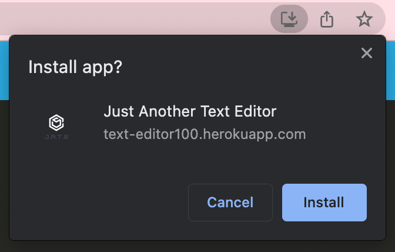
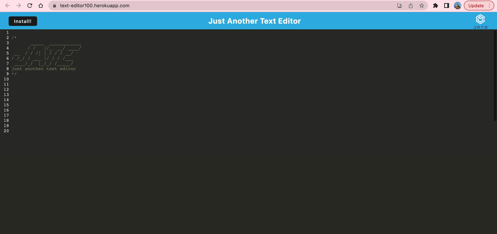

# Just Another Text Editor

  ## Description
  This project is a simple text editor, J.A.T.E. (Just Another Text Editor). It is a single page PWA that can function without internet connection and is downloadable on most devices. The project has been deployed to Heroku in order for easy access and download.
  
  ## Table of Contents 
  - [Description](#description)
  - [Installation](#installation)
  - [Usage](#usage)
  - [Questions](#questions)

  ## Installation
   Below is an example of how you can download the whole project onto your own device:

  1. Open your devices terminal application
  2. Locate to the correct file destination that you are wanting to download this project to
  3. Clone the repository using this link: 
      ```md
          git clone https://github.com/squrpe/text-editor.git
      ```
  4. You may get prompted to input you github details, thus do so. Otherwise, the project will now be succesfully installed onto your device.

  You will need to download the suitable extensions for Javascript and Node.js to run the application in the command line.

  However, if you are looking to download just the program itself you can by accessing the deployed webpage and clicking the 'Install' Button:

  

  And it will prompt you to install on the top of your webpage like this:

  

  ## Usage

  [The deployed application can be accessed here!](https://text-editor100.herokuapp.com/)

  Below is an image of the program:

  

  Once the program is opened, the IndexedDB database is accessed. As text is typed, it is automatically saved to the database. When closing and reopening the editor, the saved text is retrieved from the database. After downloading and accessing the program, an access worker is registered and the typed texted on the desktop program can also be accessed from within the browser program.

  ## Questions:
  If you have any questions, contact me here:
  - Email: squrpe@example.com

  And if you want to see my additonal work, check out my Github:
  - Github: [squrpe](https://github.com/squrpe)